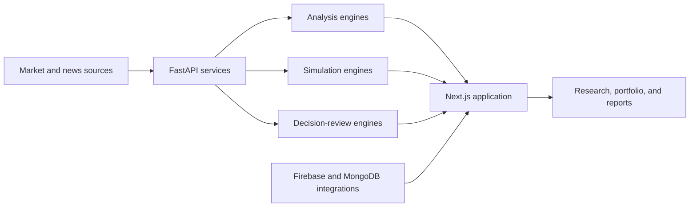

<div align="center">

# Trading Rocket

**An AI-assisted market-intelligence workspace for analysis, simulation, portfolio review, and decision journaling.**

<p>
  <a href="https://td-fawn.vercel.app/"></a>
  
  
  
</p>

<p>
  <a href="#overview">Overview</a> ·
  <a href="#platform-capabilities">Capabilities</a> ·
  <a href="#architecture">Architecture</a> ·
  <a href="#getting-started">Setup</a> ·
  <a href="#project-status">Status</a>
</p>

</div>

---

## Overview

Trading Rocket is a full-stack market-intelligence application designed to explain market context rather than reduce decisions to unsupported buy-or-sell signals. It combines live and historical market data, AI-assisted analysis, news interpretation, simulations, portfolio tools, prediction review, and behavioral-bias workflows in a unified interface.

The platform treats forecasts as scenarios with uncertainty. Its broader goal is to help users inspect evidence, record assumptions, compare predictions with outcomes, and understand why a decision succeeded or failed.

[Open the live application](https://td-fawn.vercel.app/)

## Platform capabilities

| Domain | Capabilities |
|---|---|
| Market data | Symbol lookup, intraday data, market summaries, real-time endpoints |
| Analysis | Technical analysis, company radar, market pulse, chart analysis |
| Research | Intelligent news processing, conversational analysis, report generation |
| Simulation | Investment scenarios, Monte Carlo analysis, portfolio allocation |
| Decision review | Predictions, outcomes, bias analysis, market autopsy, graveyard |
| Portfolio | Paper-portfolio workflows and generated portfolio reports |
| Scenario training | Wargame routes, scoring, and decision exercises |
| Product experience | Progressive web app support, motion system, 3D visualization, PDF export |

## Architecture



## Application areas

```text
Markets      Live and historical market context
Analytics    Technical indicators and comparative views
AI           Conversational research and explanations
Autopsy      Retrospective event and prediction analysis
Portfolio    Paper holdings and portfolio reports
Wargame      Scenario-based decision exercises
Graveyard    Review of failed or invalidated ideas
Aether       Experimental visual-analysis interface
```

## Technology

| Layer | Technologies |
|---|---|
| Web application | Next.js 14, React 18, TypeScript |
| State and validation | Zustand, Zod |
| Interface | Tailwind CSS, Framer Motion, Recharts |
| Graphics | Three.js, React Three Fiber |
| API | FastAPI, Pydantic, Uvicorn |
| Market data | yfinance and service adapters |
| Persistence | Peewee, MongoDB, Firebase integrations |
| AI providers | OpenAI and Gemini-compatible service paths |
| Delivery | Vercel frontend, Render-compatible backend configuration |

## Repository layout

```text
.
|-- app/             Next.js routes, screens, and API adapters
|-- backend/         FastAPI application, routes, services, and models
|-- components/      Shared product and visualization components
|-- features/        Feature-level interface modules
|-- lib/             Client integrations and shared application logic
|-- __tests__/       Automated test workspace
|-- scripts/         Development and maintenance utilities
`-- public/          Icons, service worker, and static assets
```

## Getting started

### Frontend

```bash
git clone https://github.com/codingyash9-bit/Trading-Rocket.git
cd Trading-Rocket
npm install --legacy-peer-deps
npm run dev
```

The application starts on `http://localhost:3000`.

### Backend

```bash
cd backend
python -m venv .venv
```

Activate the virtual environment, then run:

```bash
python -m pip install -r requirements.txt
uvicorn main:app --reload --port 8000
```

The API exposes interactive documentation at `http://localhost:8000/docs` and a health endpoint at `http://localhost:8000/health`.

### Backend environment

Create `backend/.env` and provide only the services you intend to use:

```env
ALLOWED_ORIGINS=http://localhost:3000
OPENAI_API_KEY=
GEMINI_API_KEY=
NEWSAPI_KEY=
GNEWS_API_KEY=
```

Additional routes may require provider-specific configuration. Keep all secrets server-side and outside version control.

## Core API groups

| Group | Examples |
|---|---|
| Market | `/api/market`, `/api/realtime` |
| Analysis | `/api/analyze`, `/api/company-radar`, `/api/market-pulse` |
| Research | `/api/chat`, `/api/news`, `/api/autopsy` |
| Simulation | `/api/simulate`, `/api/wargame` |
| Decision review | `/api/predictions`, `/api/outcomes`, `/api/bias`, `/api/graveyard` |
| Portfolio | `/api/portfolio` |

Refer to the generated OpenAPI documentation for the current request and response contracts.

## Available scripts

| Command | Purpose |
|---|---|
| `npm run dev` | Start the Next.js development server |
| `npm run build` | Create a production application build |
| `npm run start` | Run the production Next.js server |
| `npm run typecheck` | Validate TypeScript without emitting files |

## Project status

| Area | State |
|---|---|
| Market and analysis routes | Implemented |
| News and conversational research | Implemented service paths |
| Simulation and portfolio workflows | Implemented |
| Prediction-outcome review | Implemented service paths |
| Wargame and graveyard modules | Implemented |
| Production-grade financial guarantees | Not provided |
| Independently verified predictive accuracy | Not documented |

## Responsible use

Trading Rocket is an educational and analytical project. Market data can be delayed, third-party services can fail, and AI-generated explanations can be incorrect. Nothing in the application constitutes financial advice, an offer, or a recommendation to trade. Verify material information with primary sources and a qualified financial professional.

---

<div align="center">
  <sub>Designed and developed by <a href="https://github.com/codingyash9-bit">Yash Mahadeshvar</a>.</sub>
</div>
